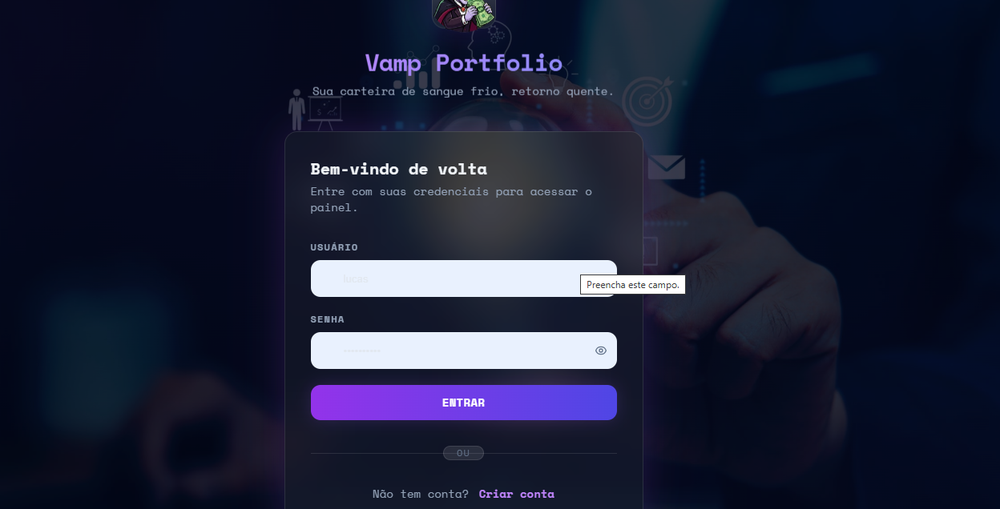
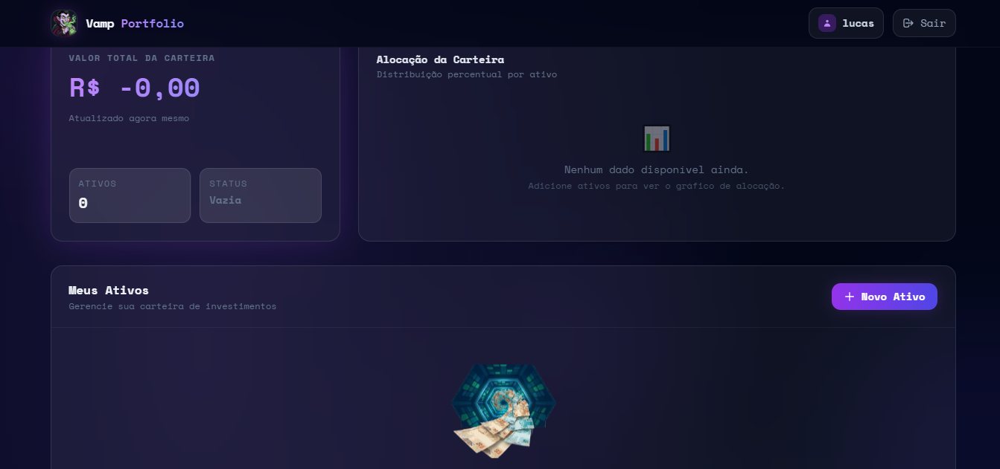
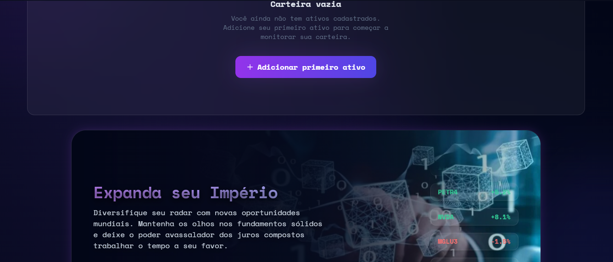
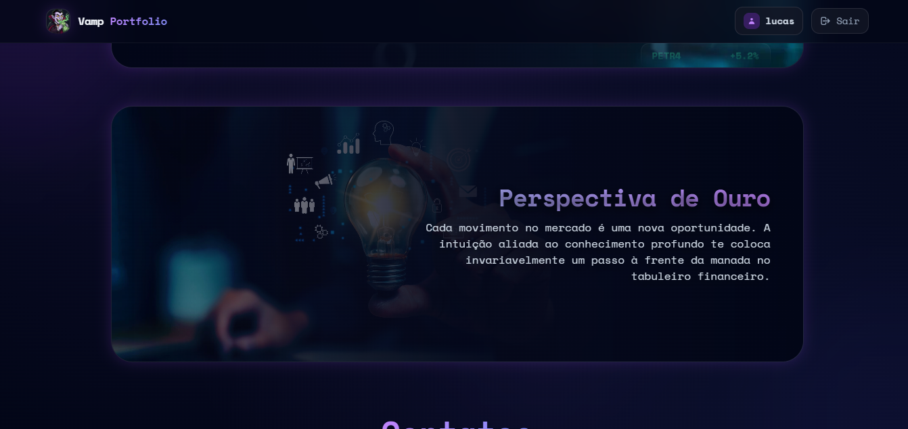
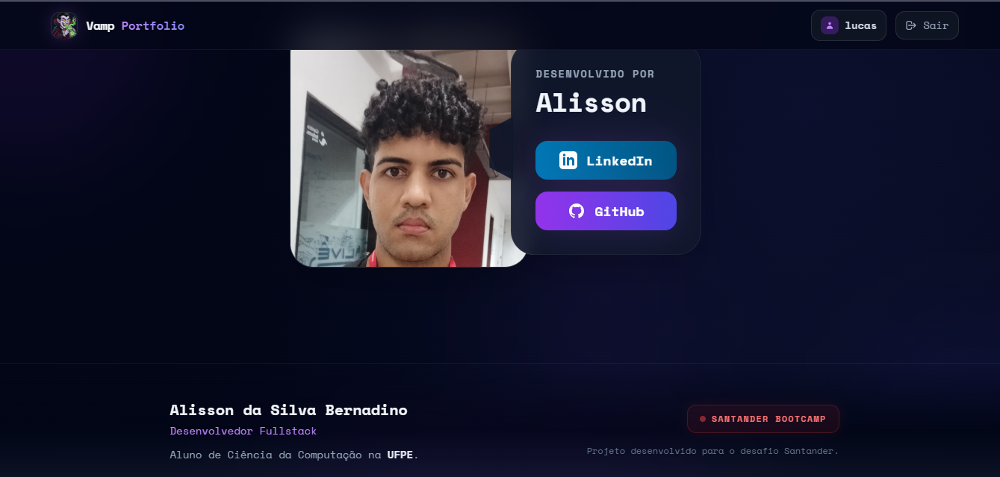
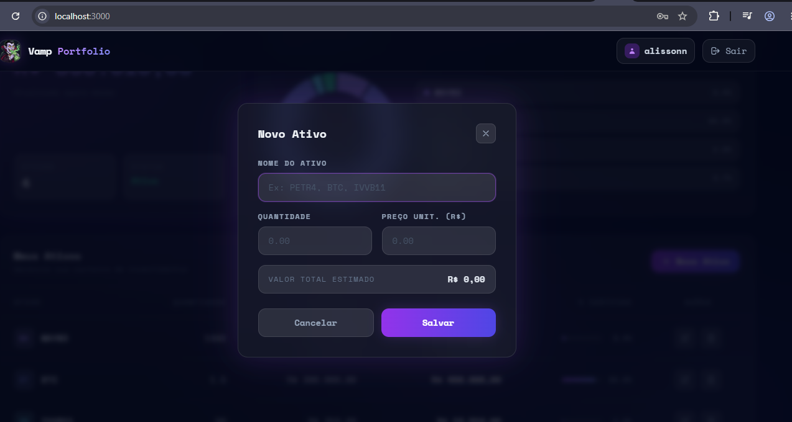
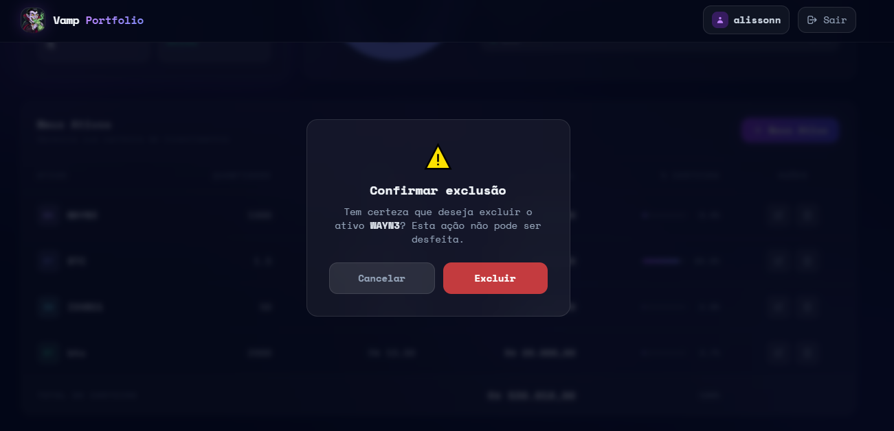
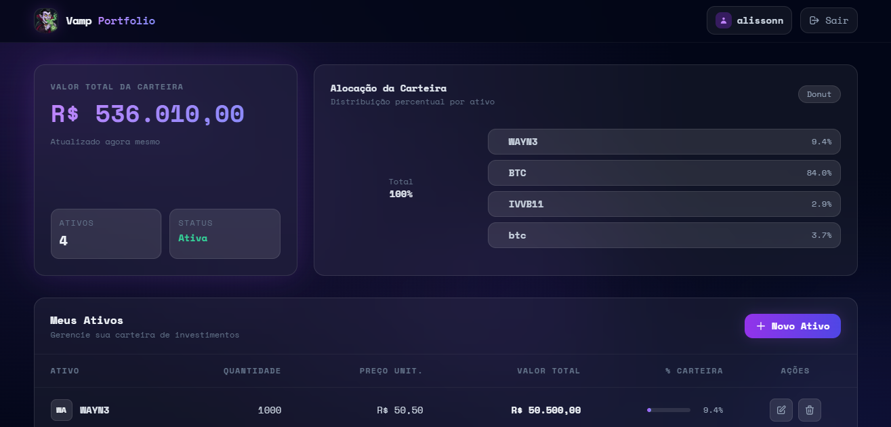
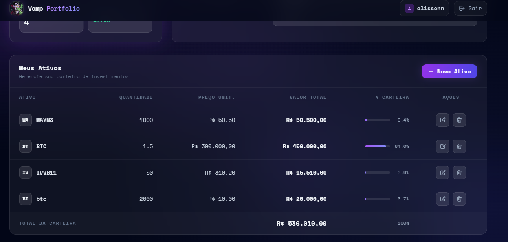

# Vamp Investment Portfolio 🧛

Bem-vindo ao **Vamp Investment Portfolio**, uma aplicação full-stack de carteira de investimentos desenvolvida em **Rust**. Este projeto permite que usuários gerenciem de forma visual os seus ativos financeiros, acompanhem a distribuição em um gráfico dinâmico e vejam as cotações refletidas no valor total da carteira.

Desenvolvido como parte de um desafio prático de arquitetura e pair programming com IA.

---

## 🎯 O que o projeto faz

Esta plataforma web permite:
1. **Cadastro e Login seguro** através do *hash* de senhas criptografadas e sessões gerenciadas via *JWT* retidos de forma segura em *cookies HttpOnly*.
2. **Painel Interativo (Dashboard)** exibindo sumário de valores na sua carteira, balanço total em *BRL*, estado vazio animado e listagem visual por ativos.
3. **Distribuição Real e Gráfico:** Gera gráficos dinâmicos de *doughnut* para mostrar a exposição financeira a cada segmento de investimento ou ticker.
4. **CRUD de Ativos Integrado:** Modais nativos sem reload total de página para inclusão, edição e deleção de novos ativos.
5. **Isolamento de Dados:** Cada usuário enxerga apenas a sua carteira, num banco estritamente relacional em *PostgreSQL*.

---

## 📸 Galeria da Aplicação

Confira abaixo o design visual focado em *Glassmorphism dark*, criado para transmitir o sentimento de uma ferramenta fintech premium e exclusiva, com todas as telas que desenvolvemos.

### 1. Autenticação (Login & Registro)
Nossa tela de entrada funde blocos de vidro sobre backgrounds cinematográficos em *fade-in*, dando boas-vindas aos novos e velhos investidores à carteira sombria.
<div align="center">
   
  &nbsp;
  
</div>

### 2. Dashboard: Estado Inicial (Vazio)
Para quem acaba de criar a conta, o software apresenta um ambiente imersivo (com arte e animações baseadas no tema *Vamp*), chamando atenciosamente o utente à ação de cadastrar seu primeiro investimento. É composto por diversas sessões ocultas de navegação que interagem por scroll de tela.
<div align="center" style="margin-bottom: 10px;">
  
  &nbsp;
  
</div>
<div align="center">
  
  &nbsp;
  
</div>

### 3. Operações Desacopladas (Modais Assíncronos)
As ações vitais como "Adicionar Novo Ativo" (CR) e "Excluir" (D) nunca recarregam brutalmente a página. Elas chamam caixas de diálogo modais fluídas que embaçam os fundos da tela em tempo-real (backdrop-blur API), provendo sumários antes do ok final.
<div align="center">
  
  &nbsp;
  
</div>

### 4. Dashboard Completo: A Magia do Portfólio
Ao popular os ativos com valores, um gráfico moderno de *Doughnut* via ChartJS desperta, distribuindo automaticamente a exposição por ativo com esquemas de cores vivas calculadas direto do banco de dados Rust. Nos recortes inferiores, revelam-se os visuais de estatística e a requintada área de encaixe (Dovetail Joint) de "Contatos".
<div align="center">
  
  &nbsp;
  
</div>

---

## 🚀 Como executar o projeto

Podes pôr a aplicação a rodar do zero em menos de 5 minutos, garantindo que o PostgreSQL esteja via Docker, e rodando a aplicação com Cargo:

1. **Subir a base de dados em contêineres Docker:**
   ```bash
   docker compose up -d
   ```

2. **Criar as tabelas através do SQLx (Migrações):**
   ```bash
   cargo sqlx migrate run
   ```

3. **Inciar o servidor web na porta 3000:**
   ```bash
   cargo run
   ```

> [!TIP]
> **Acesso Local:** O servidor estará disponível na URL primária: `http://localhost:3000`.

---

## 🛠️ Tecnologias Usadas

O core técnico reside em `Rust`, listando infraestrutura por:

- **axum**: Framework web minimalista e extremamente performático, utilizado para compor as rotas e injetar *extractors* e middleware.
- **sqlx**: ORM / Query Builder focado em async que permite validações estritas de tipos do SQL direto ao compilar (*compile-time checked queries*), acoplado ao servidor driver do *PostgreSQL*.
- **askama**: Engine de templates em backend (estilo *Jinja2*) utilizado para server-side rendering veloz, seguro e garantindo HTML gerado estaticamente via macros de rust.
- **jwt-simple**: Geração moderna e validação criptográfica (HS256) de JSON Web Tokens que persistem estado do utlizador na aplicação de forma robusta e em Cookies (`axum-extra`).
- **password-auth**: Hash de senhas via Argon2 para encriptação unidirecional salgada do lado do server.
- **tokio**: Ambiente assíncrono para rede (Async Runtime padrão da comunidade Rust).
- **chart.js & TailwindCSS**: Libs via CDN para estilização em glassmorphism dark na UI e plotagem flexível do gráfico visual de finanças no frontend.

---

## 🌟 Melhorias em relação ao escopo mínimo

Fomos longe e aprimoramos drasticamente a experiência base requerida:
- **Painel Avançado (Dashboard):** A página original (apenas *"Hello username"*) foi totalmente reescrita com cartões de balanço resumido em Reais (R$), lógica de porcentagem automática e suporte offline estético (Vampiro para *empty state*). 
- **Modais Assíncronos & Feedback UX (Toasts):** Fomentamos formulários para edição que abrem por transparência de cima via *pure JS* (sem necessitar recarregar as páginas) disparando eventos do Fetch API, retornando `Toasts` dinâmicos (Pop-ups verdes e vermelhos animado de cantos).
- **Tratamento Seguro Anti-Fraud/Erro (Frontend):** Tratamos os erros em raw (ex: `Asset does not exist`) do backend com uma interface JS transparente com traduções (*ex: Ativos com cotação abaixo de 0 dão hint nativo no UI*).
- **Integração Real de Tipagem UI/Askama (`f64` -> `%`)**: Os inputs monetários numéricos da linguagem passam por pré-formatação (`fmt_brl()`) no backend para entregar visuais limpos em tela para o utente.

---

## 🧪 Como testar a aplicação

### Testes Automáticos
Escrevemos uma suíte de testes de integração robusta no SQLx envolvendo transações puras, isolamento (`Isolation()`), validações nulas e falsas, cobrindo todo o setup da API `CRUD`. Executa através do cargo:
```bash
cargo test
```

### Roteiro Manual (Avaliativo)
Você pode abrir o console e validar na mão toda a magia fluindo na UI:
1. Abra `http://localhost:3000/register` e crie um login (`test`, senha `123`).
2. Aguarde o app redirecionar você para o `/login` e de lá o painel será populado.
3. Clique em **"Novo Ativo"**; insira `CASH3`, quantia `500.5`, preço `1.2`. Clicando em `Salvar`, o gráfico "Donut" reativa-se com uma única rodela.
4. Adicione um novo (`SBSP3`, `800`, `94.50`) -> o dashboard rebalanceia os assets dando novo status a legenda!
5. Teste o estado de **err()** no Backend: Clique em novo, zere na tela os valores. Note o toast ou bloco de validação alertar vermelho.
6. Delete o primeiro registro com confirmação 🪓 da lixeira.

---

## 🧠 Relato do Aprendizado Pessoal

Nesta jornada de desenvolvimento construindo este artefato eu pude enxergar profundamente a essência da "segurança em tempo de compilação" proposta pela linguagem Rust. Diferente de projetos tradicionais de frameworks opinados, entender e estruturar como injetar estados pelo `FromRequestParts` do **Axum** permitiu criar uma extração linda de tokens customizados na API sem gerar repetição de verificação em cada rota nova.

A adoção do **Askama**, aliada ao Tailwind e Chart JS via modais assíncronos de `fetch`, comprova que você não precisa sempre renderizar gigantes payloads em Virtual DOM (*React/SPA*) para entregar interfaces que reagem agudamente com sensação premiada e bonita por UI moderna. Usando `macros SQLx`, fiquei abismado como erros de DB estouram em compilação; refatorar um tipo no painel força-te a ajustar toda a pipeline back e front de imediato de forma impiedosa, porém extremamente segura!
Colecionar JWT em cookies encriptados para persistir as sessões blindou ainda mais todo meu ciclo. Foi recompensador emular os processos até fechar!
